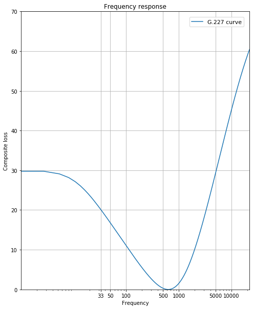

ITU-T G.227 疑似音声信号発生器
==============================

無線機の特性試験の試験方法に登場する「疑似音声信号発生器」を WebAudio で実現します。

「擬似音声発生器は、白色雑音をＩＴＵ－Ｔ勧告Ｇ．227の特性を有するフィルタによって帯域制限したものとする。」

## 仕組みや利用技術

WebAudio で音声を生成しています。白色雑音を生成するために AudioWorkletNode を使っているため、サポートするブラウザが必要です。

 * Google Chrome 67
 * Mozilla Firefox 76
 * Microsoft Edge 79

## 測定器としての使用方法

実際の無線機測定に使用する場合は、以下のガイドを参照してください：

- **[測定器としての使用ガイド](./MEASUREMENT_GUIDE.md)** - DAC選定、校正方法、セットアップ手順

## ITU-T G.227 のフィルタ設計



ITU-T G.227 記載のアナログフィルタを双一次変換してデジタルIIRフィルタとし、さらにFIRで補正しています。係数の算出は以下の通り Jupyter Notebook で行いました。

理論特性に対する相対誤差は0.29%（dB換算で0.025dB）以下を実現しています。

- https://nbviewer.jupyter.org/github/cho45/pseudo-audio-signal/blob/master/docs/03-iir-fir.ipynb

## 実装アーキテクチャ

### 信号処理フロー

```
White Noise → IIR Filter → FIR Filter → Output
Generator      (4th order)   (Correction)
   |               |             |
   |               |             |
AudioWorklet   coeffs.json[0] coeffs.json[1]
```

### 雑音発生方式

ホワイトノイズ生成には **Box-Muller変換** を使用し、正規分布に従う高品質な雑音を生成しています：

### フィルタ係数

すべてのフィルタ係数は `coeffs.json` に事前計算済みで格納されています：

- `coeffs.json[0]`: IIRフィルタ係数 (双一次変換によるデジタル化)
- `coeffs.json[1]`: FIRフィルタ係数 (高周波誤差補正用)

### WebAudio API実装

```javascript
// IIRフィルタ (4次)
const iirFilter = audioContext.createIIRFilter(coeffs[0].num, coeffs[0].den);

// FIRフィルタ (畳み込み)
const firFilter = audioContext.createConvolver();
// coeffs[1] をインパルス応答として設定
```

この2段階のフィルタリングにより、ITU-T G.227の理論特性を高精度で実現しています。

## 参考資料

 * <a href="https://www.tele.soumu.go.jp/resource/j/equ/tech/betu/35.pdf">別表第三十五 証明規則第２条第１項第12号に掲げる無線設備の試験方法</a> (アマチュア無線機の試験方法)
 * <a href="https://www.itu.int/rec/T-REC-G.227-198811-I/en">ITU-T Recommendation G.227</a>

